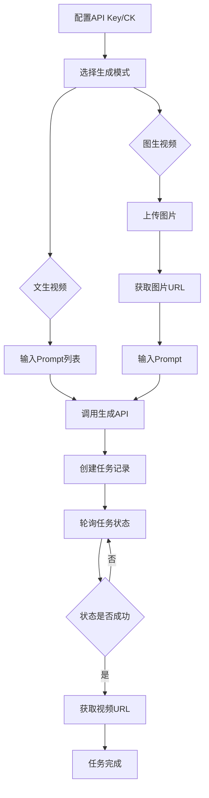
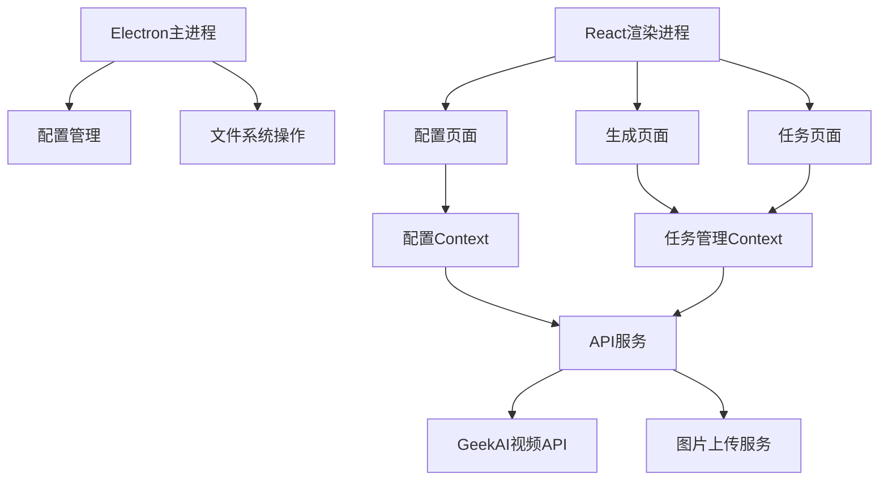
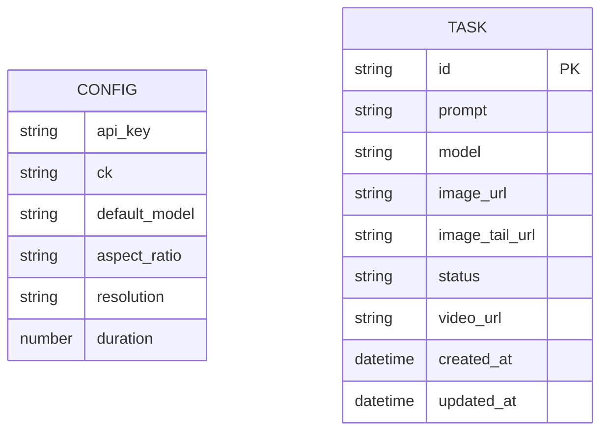

## 1. Product Overview
极客智坊视频批量生成工具是一款桌面端应用程序，帮助用户高效批量生成视频内容。支持文生视频、图生视频（单图/首尾帧/多图）模式，集成图片上传功能，提供任务管理和状态追踪能力。

## 2. Core Features

### 2.1 User Roles
| Role | Registration Method | Core Permissions |
|------|---------------------|------------------|
| 用户 | 本地配置API Key | 视频生成、任务管理、图片上传 |

### 2.2 Feature Module
1. **配置页面**: API Key配置、CK配置、模型参数设置
2. **视频生成页面**: 批量任务创建、文生视频、图生视频
3. **任务管理页面**: 任务列表、状态查询、结果查看、下载

### 2.3 Page Details
| Page Name | Module Name | Feature description |
|-----------|-------------|---------------------|
| 配置页面 | API配置 | 配置GeekAI API Key、CK、默认模型等参数 |
| 配置页面 | 图片上传配置 | 配置图片上传相关参数 |
| 视频生成页面 | 文生视频 | 输入prompt生成视频，支持批量导入 |
| 视频生成页面 | 图生视频 | 上传图片生成视频，支持首尾帧模式 |
| 任务管理页面 | 任务列表 | 展示所有任务，支持状态筛选 |
| 任务管理页面 | 任务详情 | 查看任务进度、下载生成的视频 |

## 3. Core Process
用户首先配置API Key和CK，然后在视频生成页面创建任务（文生视频或图生视频），系统自动上传图片（如需要）并调用API生成视频，用户可在任务管理页面查看任务状态，等待生成完成后下载视频。



## 4. User Interface Design

### 4.1 Design Style
- **主色调**: 深蓝色系 (#1e40af)，科技感
- **辅助色**: 天蓝色 (#3b82f6)，用于强调和交互元素
- **成功色**: 绿色 (#22c55e)，用于完成状态
- **警告色**: 橙色 (#f97316)，用于处理中状态
- **错误色**: 红色 (#ef4444)，用于失败状态
- **按钮风格**: 圆角矩形，hover时有阴影效果
- **字体**: 思源黑体，现代简洁
- **布局**: 卡片式布局，左侧导航，右侧内容区

### 4.2 Page Design Overview
| Page Name | Module Name | UI Elements |
|-----------|-------------|-------------|
| 配置页面 | API配置 | 输入框、密码框、下拉选择、保存按钮 |
| 配置页面 | 图片上传配置 | 输入框、提示信息 |
| 视频生成页面 | 文生视频 | 文本输入区域、批量导入按钮、生成按钮 |
| 视频生成页面 | 图生视频 | 图片上传区域、首尾帧切换、输入框 |
| 任务管理页面 | 任务列表 | 表格、状态标签、操作按钮 |
| 任务管理页面 | 任务详情 | 进度条、视频预览、下载按钮 |

### 4.3 Responsiveness
- 桌面优先设计，支持1024px以上分辨率
- 响应式布局，适配不同屏幕尺寸
- 触摸友好的按钮尺寸（最小44px）

### 4.4 交互设计
- 任务状态实时更新（轮询机制）
- 图片上传拖拽支持
- 批量操作支持
- 错误提示和成功反馈

---

## 技术架构文档

## 1. Architecture Design

```mermaid
layeredGraph LR
    subgraph Frontend
        A[Electron主进程] --> B[React渲染进程]
        B --> C[UI组件层]
        B --> D[状态管理层]
        B --> E[API服务层]
    end
    
    subgraph External Services
        F[GeekAI视频生成API]
        G[腾讯云COS存储]
    end
    
    E --> F
    E --> G
```

## 2. Technology Description
- **前端框架**: React@18 + TypeScript
- **UI框架**: TailwindCSS@3
- **构建工具**: Vite@6
- **桌面框架**: Electron@28
- **状态管理**: React Context + useState
- **HTTP客户端**: Axios
- **图标库**: Lucide React

## 3. Route Definitions
| Route | Purpose |
|-------|---------|
| /config | 配置页面 |
| /generate | 视频生成页面 |
| /tasks | 任务管理页面 |

## 4. API Definitions

### 4.1 视频生成API
**POST** `/api/v1/videos/generations`
```typescript
interface VideoGenerationRequest {
    model: string;
    prompt: string;
    image?: string | string[];
    image_tail?: string;
    async: boolean;
    aspect_ratio?: string;
    resolution?: string;
    duration?: number;
}

interface VideoGenerationResponse {
    task_id: string;
    task_status: 'running' | 'succeed' | 'failed';
    model: string;
    video_result?: Array<{ url: string }>;
}
```

### 4.2 任务查询API
**GET** `/api/v1/videos/{task_id}`
```typescript
interface TaskQueryResponse {
    model: string;
    task_id: string;
    task_status: 'running' | 'succeed' | 'failed';
    video_result?: Array<{ url: string }>;
}
```

### 4.3 图片上传API
**POST** `/api/block`
```typescript
interface ImageUploadRequest {
    md5: string;
    name: string;
    type: string;
    size: number;
    url: string;
    channel: string;
}

interface ImageUploadResponse {
    data: {
        uuid: string;
        name: string;
        size: number;
        size_text: string;
        type: string;
        type_text: string;
        status: number;
        status_text: string;
        url: string;
        md5: string;
        channel: string;
    };
}
```

## 5. Server Architecture Diagram



## 6. Data Model

### 6.1 Data Model Definition


### 6.2 Data Storage
- **配置数据**: 使用Electron的本地存储（localStorage）
- **任务数据**: 使用JSON文件存储在用户数据目录

## 7. 核心模块设计

### 7.1 API服务模块
- 处理视频生成API调用
- 处理任务状态轮询
- 处理图片上传

### 7.2 配置管理模块
- 读取/保存配置
- 验证配置有效性

### 7.3 任务管理模块
- 创建任务
- 轮询状态
- 保存任务记录

### 7.4 图片上传模块
- MD5计算
- COS上传
- Block记录创建