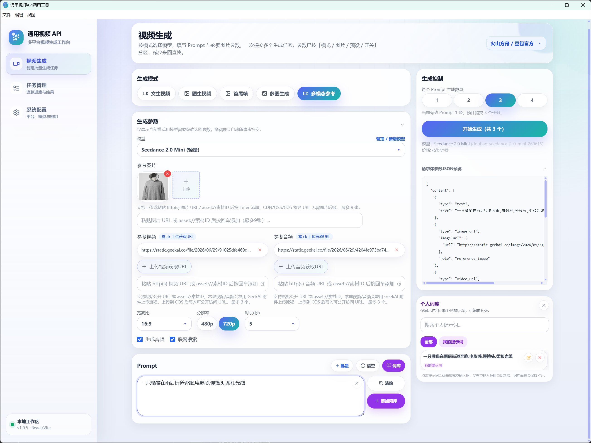
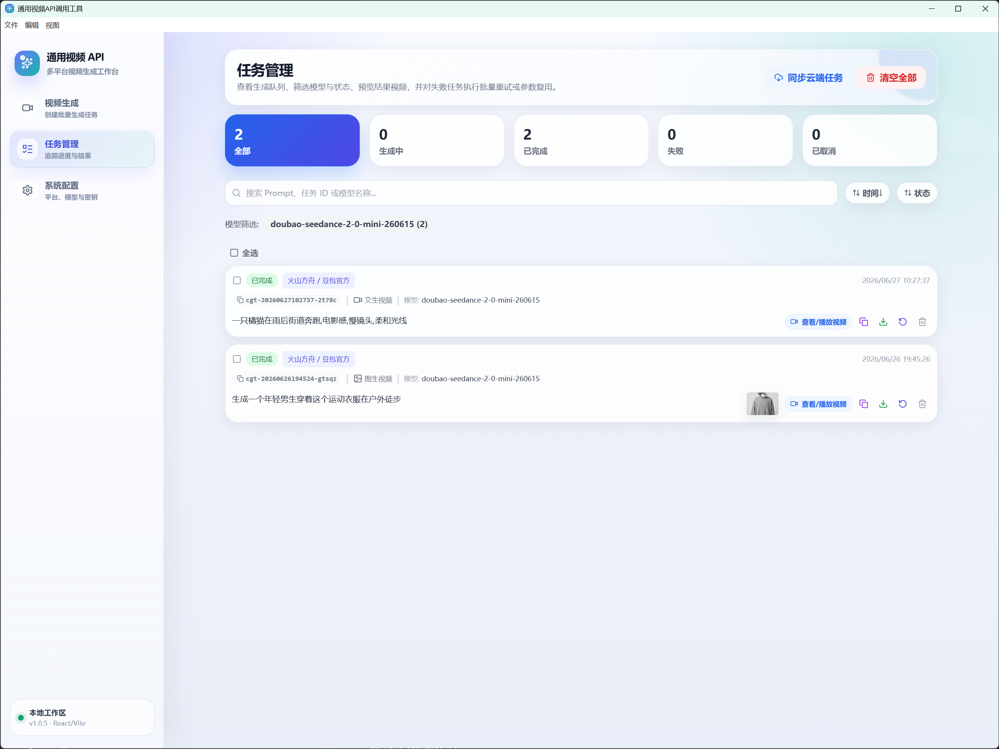
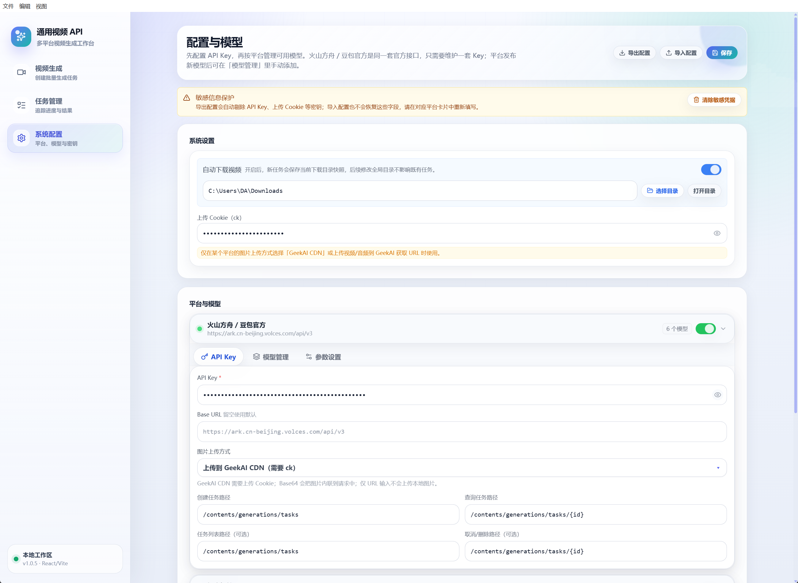

# AIVideoForge — AI 视频工坊

<p align="center">
  
</p>

<p align="center">
  <strong>多平台 AI 视频批量生成桌面工作台</strong>
</p>

<p align="center">
  <a href="https://github.com/LuluDeer/AIVideoForge/actions/workflows/release.yml"></a>
  <a href="https://github.com/LuluDeer/AIVideoForge/releases"></a>
  <a href="LICENSE"></a>
  
  
</p>

---

AIVideoForge 是一个面向 AI 视频创作者、运营团队和开发者的多平台 AI 视频批量生成桌面工作台。项目基于 React、TypeScript、Vite 与 Electron 构建，支持多平台视频生成接口统一接入、文生视频、图生视频、首尾帧、多图生成、多模态参考、任务轮询、失败重试、自动下载、模型参数管理与安全配置导入导出。

> AIVideoForge 当前内置支持 Seedance / 火山方舟、GeekAI、APIZZZ、Kling 等平台，并提供自定义平台与自定义模型能力，方便接入兼容接口或团队内部中转服务。

## 感谢 GeekAI 存储与 CDN 上传支持

对于图生视频、首尾帧、多图生成和多模态参考等场景，视频生成接口通常需要能够被模型服务访问的公网素材 URL。本项目将 GeekAI 的素材上传 / CDN 存储能力作为重要能力之一：你可以在桌面端选择本地图片等素材，工具会尝试将其上传为可访问 URL，并自动写入后续生成请求，减少手动找图床、复制链接和处理素材托管的成本。

GeekAI 是一个企业级统一 AI 模型智能调度平台，官网介绍其支持多类主流 AI 模型，并提供统一 API 入口、更高并发、模型调度和开发者接入能力。是一个专业的中转站平台，有非常多种类完善的模型供大家使用。本项目在素材上传和模型调用场景中对 GeekAI 做了适配，感谢 GeekAI 为开发者生态提供的模型聚合与存储服务支持。

- GeekAI 官网：<https://geekai.co/>
- GeekAI API 文档：<https://docs.geekai.co/>
- 作者 GeekAI 邀请链接：<https://geekai.co/chat?invite_code=rLGqYn>

使用建议：

1. 在「配置与模型」页面选择 GeekAI，或选择支持 GeekAI 上传模式的平台。
2. 填写平台 API Key，并按需填写上传 Cookie / 上传配置。
3. 在生成页上传本地图片，系统会尝试将素材上传为可访问 CDN URL。
4. 上传成功后，生成请求会使用该 URL 作为图片、首尾帧或多模态参考素材。

> 注意：请仅上传你有权使用的素材。公开 URL 可能被第三方视频生成平台访问，请避免上传敏感、隐私或未授权内容。

GeekAI Cookie的获取，登录GeekAI平台后在任意网页按F12进入开发者模式，点击控制台(console)，在输入框内粘贴运行以下脚本即可获取，获取成功后可在客户端系统配置的CK处填入。
> GeekAI的cookie注意安全保存，避免泄露导致GeekAI平台资产被盗用的情况
```JavaScript
(function(){
    const cookieStr = document.cookie;
    const headerCookie = `${cookieStr}`;
    prompt("复制下方全部内容", headerCookie);
})();
```

## 效果预览

| 视频生成                                     | 任务管理                                  |
| ---------------------------------------- | ------------------------------------- |
|  |  |

| 配置与模型                                   | <br /> |
| --------------------------------------- | ------ |
|  | <br /> |

<br />

- **多平台统一工作台**：通过统一的平台、模型、参数抽象，降低不同视频生成 API 的使用成本。
- **多种生成模式**：支持文生视频、图生视频、首尾帧生成、多图生成、多模态参考等常见创作场景。
- **批量提交任务**：支持多个提示词与生成数量组合提交，适合批量测试创意、投放素材和内容生产。
- **任务全生命周期管理**：提供任务状态轮询、手动刷新、云端同步、取消任务、失败重试、批量重试、参数复用等能力。
- **模型与参数可配置**：内置平台可扩展模型，自定义平台可配置接口、模型、参数 schema 与 API 格式。
- **桌面端增强能力**：基于 Electron 支持选择下载目录、打开本地目录、自动下载生成视频等本地能力。
- **安全配置导入导出**：配置导出会自动剔除 API Key、上传 Cookie 等敏感字段，避免误泄露凭据。
- **本地优先的数据存储**：配置与任务历史默认保存在本地，适合个人工作流和轻量团队使用。

## 功能概览

### 视频生成

生成页提供完整的视频生成入口：

- 平台切换：在已启用平台之间快速切换。
- 模型选择：按当前生成模式筛选可用模型。
- 模式支持：
  - `text`：文生视频
  - `image`：图生视频
  - `imageTail`：首尾帧生成
  - `multiImage`：多图生成
  - `multiModal`：多模态参考，支持图像、视频、音频等参考素材
- 参数面板：根据模型定义动态展示分辨率、比例、时长、增强提示词、水印、音频等参数。
- 请求预览：便于检查最终提交给接口的参数结构。
- 提示词库：支持自定义提示词保存、分类、搜索、编辑和复用。
- 图片输入：支持公开 URL、本地上传转 URL、Base64 等不同平台适配策略。

### 任务管理

任务页用于集中管理已提交的视频生成任务：

- 任务状态展示：待处理、运行中、成功、失败、已取消。
- 自动轮询：运行中任务会自动查询接口状态，并在连续错误过多时暂停轮询，保留手动刷新能力。
- 云端同步：支持从平台拉取远端任务列表，补齐本地任务状态。
- 手动刷新：单个任务可主动查询最新状态。
- 任务取消：如果平台提供删除/取消接口，则请求云端取消；否则仅本地停止跟踪。
- 失败重试：支持单任务重试与批量重试。
- 参数复用：从历史任务恢复模型、模式、提示词和参数，快速生成变体。
- 搜索与筛选：支持按状态、模型、任务 ID、提示词搜索。
- 结果下载：支持手动下载生成视频。
- 自动下载：桌面端可在任务成功后自动保存视频到指定目录。

### 配置与模型管理

配置页用于管理平台凭据、接口地址、模型列表和系统设置：

- 内置平台配置：维护 API Key、Base URL、接口端点、上传方式等信息。
- 自定义平台：新增任意兼容接口平台，配置创建任务、查询任务、任务列表、删除任务等端点。
- 自定义模型：为内置平台或自定义平台添加额外模型。
- 参数覆盖：对模型参数默认值、可选项、启用状态进行覆盖。
- 默认模型：按平台设置默认模型。
- 平台停用：隐藏暂时不用的平台或模型。
- 自动下载目录：桌面端选择并打开本地下载目录。
- 安全导入导出：导出文件默认命名为 `video-gen-config.safe.json`，不会包含 API Key 或 Cookie。
- 敏感凭据清除：一键清除本地保存的 API Key、上传 Cookie 等敏感字段。

## 内置平台

项目通过 `PLATFORM_DEFS` 内置多套平台定义：

| 平台              | 说明                                             |
| --------------- | ---------------------------------------------- |
| Seedance / 火山方舟 | 面向豆包 Seedance 官方视频生成能力，使用 Seedance content 格式。 |
| GeekAI          | 面向 GeekAI 聚合接口，默认支持 GeekAI 素材上传 / CDN 存储能力。    |
| APIZZZ          | 面向 APIZZZ 类中转平台。                               |
| Kling           | 面向 Kling 视频生成接口，支持文生视频与图生视频端点适配。               |

同时保留 `doubao-official` 到 `seedance` 的兼容迁移逻辑，旧配置可以自动归并到新的 Seedance 平台定义。

## API 格式适配

项目内部使用统一的 `VideoGenerationRequest` 请求结构，并在提交前根据平台或模型的 `apiFormat` 转换为目标格式。

当前支持三类 API 格式：

| 格式         | 说明                                                 |
| ---------- | -------------------------------------------------- |
| `unified`  | 直接按统一字段输出 JSON 请求体，适合大多数中转站或自定义服务。                 |
| `openai`   | 转换为 OpenAI 兼容的 `multipart/form-data` 格式。           |
| `seedance` | 转换为 Seedance 官方 `content[]` 多模态结构，支持文本、图片、视频、音频角色。 |

参数定义支持 `apiKey` 映射，可以将 UI 中的参数名转换为接口所需字段名，便于兼容不同平台的字段差异。

## 技术栈

- **React 19**：构建交互式前端界面。
- **TypeScript 5**：提供类型约束和更稳定的维护体验。
- **Vite 6**：用于本地开发和前端构建。
- **Electron 42**：提供桌面端能力和安装包构建。
- **electron-builder**：打包 Windows 桌面应用。
- **Tailwind CSS 3**：用于快速构建响应式界面样式。
- **Axios**：封装视频生成平台 HTTP 请求。
- **Vitest**：用于单元测试。
- **ESLint**：用于代码质量检查。

## 目录结构

```text
ai-video-forge/
├── electron/                  # Electron 主进程与预加载脚本
│   ├── main.ts
│   └── preload.js
├── src/
│   ├── components/            # 通用 UI 组件
│   ├── context/               # 配置与任务上下文
│   ├── hooks/                 # 通用 React hooks
│   ├── pages/                 # 主页面：生成、配置、任务
│   ├── services/              # API、模型模板、上传、配置导入导出等服务
│   │   ├── api/               # 请求构建、响应归一化、错误处理
│   │   └── modelTemplates/    # 内置平台与模型定义
│   ├── types/                 # 全局类型定义
│   └── utils/                 # 存储、日志、任务状态等工具
├── package.json
├── tsconfig.json
└── vite.config.ts
```

## 快速开始

### 环境要求

建议使用以下环境：

- Node.js 20 或更高版本
- npm 10 或更高版本
- Windows 环境用于完整体验 Electron 桌面打包能力

### 安装依赖

```bash
npm install
```

### 启动 Web 开发模式

```bash
npm run dev
```

启动后访问 Vite 输出的本地地址即可使用 Web 版本。Web 版本不支持选择本地目录、自动下载到本地、文件上传转 URL 等 Electron 专属能力。

### 启动 Electron 开发模式

```bash
npm run electron:dev
```

桌面端模式可以使用以下增强能力：

- 选择本地自动下载目录
- 打开本地下载目录
- 自动下载生成完成的视频
- 设置上传 Cookie 到 Electron 会话

### 构建前端产物

```bash
npm run build
```

### 打包桌面应用

```bash
npm run electron:build
```

打包产物会输出到 `release/` 目录。

### 仅生成未安装目录包

```bash
npm run electron:pack
```

## 常用脚本

| 命令                       | 说明                    |
| ------------------------ | --------------------- |
| `npm run dev`            | 启动 Vite 开发服务器。        |
| `npm run build`          | TypeScript 编译并构建前端产物。 |
| `npm run lint`           | 运行 ESLint 检查。         |
| `npm run test`           | 运行 Vitest 单元测试。       |
| `npm run preview`        | 预览构建后的前端产物。           |
| `npm run electron:dev`   | 启动 Electron 开发模式。     |
| `npm run electron:build` | 构建前端并打包桌面安装程序。        |
| `npm run electron:pack`  | 生成 Electron 目录包。      |

## 使用指南

### 1. 配置平台

首次使用时，进入「配置与模型」页面：

1. 选择一个内置平台或创建自定义平台。
2. 填写 API Key。
3. 如有需要，修改 Base URL 或接口端点。
4. 选择图片上传方式。
5. 保存配置。

如果使用桌面端并需要自动下载，请开启「自动下载视频」并选择下载目录。

### 2. 配置模型和参数

对于内置平台，可以：

- 添加平台新增但项目尚未内置的新模型。
- 修改模型支持的生成模式。
- 调整模型参数默认值和可选项。
- 停用暂时不用的模型。

对于自定义平台，需要至少配置：

- 平台 ID 与名称
- Base URL
- API Key
- 创建任务端点
- 查询任务端点
- API 格式
- 至少一个模型

### 3. 提交生成任务

进入「生成视频」页面：

1. 选择平台。
2. 选择生成模式。
3. 选择模型。
4. 输入一个或多个提示词。
5. 上传图片或填写公开素材 URL。
6. 调整模型参数。
7. 设置生成数量。
8. 提交任务。

任务提交后会自动进入任务列表，并开始轮询状态。

### 4. 管理任务结果

进入「任务列表」页面：

- 查看任务状态和生成结果。
- 手动刷新单个任务。
- 从云端同步任务列表。
- 下载成功任务的视频。
- 失败任务可直接重试。
- 对历史任务点击参数复用，快速回到生成页创建变体。

## 配置与数据存储

项目采用本地优先的数据存储策略：

| 数据     | 默认存储位置                                  |
| ------ | --------------------------------------- |
| 应用配置   | `localStorage` 的 `video_gen_app_config` |
| 任务历史   | `localStorage` 的 `geekai_tasks`         |
| 提示词库   | 浏览器本地存储                                 |
| 自动下载文件 | 用户选择的本地目录，仅 Electron 桌面端可用              |

配置 schema 当前版本为 `2`，项目包含旧配置迁移逻辑，可以从早期 `geekai_config` 配置迁移到新的多平台结构。

## 安全说明

项目在配置管理上做了多项安全处理：

- 导出配置时会清空 `uploadCk`、内置平台 API Key、自定义平台 API Key。
- 导入配置时不会覆盖当前本地敏感凭据。
- 导入 JSON 会过滤 `__proto__`、`constructor`、`prototype` 等可能导致原型污染的字段。
- 导入文件限制为 512KB 以内，避免异常大文件影响使用。
- 配置页提供「清除敏感凭据」能力，可清空本地 API Key 和上传 Cookie。

请注意：API Key 仍会保存在本地浏览器或 Electron 环境中。不要在公共电脑或不可信环境中保存生产级密钥。

## 自定义平台接入

自定义平台适合以下场景：

- 团队内部对多个视频模型做了统一代理。
- 使用兼容 OpenAI、多模态或自定义 JSON 格式的视频生成服务。
- 新平台暂未内置，但接口能力与项目抽象匹配。

一个平台至少需要提供：

```ts
interface CustomPlatformDef {
  id: string;
  name: string;
  baseUrl: string;
  apiKey: string;
  endpoints: {
    createVideo: string;
    queryTask: string;
    queryTaskList?: string;
    deleteTask?: string;
  };
  apiFormat: 'unified' | 'openai' | 'seedance';
  imageUploadMode?: 'geekai' | 'base64' | 'url';
  defaultModel?: string;
  models?: CustomModelDef[];
}
```

模型参数可以定义为字符串、数字、布尔值、图片、图片数组、视频、视频数组、音频、音频数组、对象或数组等类型。前端会根据参数定义动态渲染输入控件，并在提交时构造请求。

## 测试

运行单元测试：

```bash
npm run test
```

当前项目已包含任务状态、任务工具、任务展示、API 错误归一化、图片输入、提示词库、配置导入导出等测试用例。

## 代码质量检查

运行 ESLint：

```bash
npm run lint
```

构建前建议执行：

```bash
npm run lint
npm run test
npm run build
```

## 开发约定

- 平台与模型的默认定义放在 `src/services/modelTemplates/`。
- API 请求转换逻辑放在 `src/services/api/payloadBuilders.ts`。
- API 响应归一化逻辑放在 `src/services/api/responseNormalizer.ts`。
- API 错误归一化逻辑放在 `src/services/api/errorNormalizer.ts`。
- 配置持久化和迁移逻辑放在 `src/context/ConfigContext.tsx` 与 `src/services/configSchema.ts`。
- 任务状态、轮询、重试和自动下载逻辑放在 `src/context/TaskContext.tsx`。
- 通用类型统一维护在 `src/types/index.ts`。

## 路线图

- [ ] 增加更多视频生成平台模板。
- [ ] 增加任务队列并发控制。
- [ ] 增加批量导入提示词文件。
- [ ] 增加更细粒度的任务分组和标签管理。
- [ ] 增加平台连通性测试。
- [ ] 增加配置加密存储能力。
- [ ] 增加 macOS / Linux 打包配置。

## 贡献指南

欢迎提交 Issue 和 Pull Request。

建议贡献流程：

1. Fork 本仓库。
2. 创建功能分支。
3. 保持代码风格一致，并补充必要测试。
4. 执行 `npm run lint`、`npm run test`、`npm run build`。
5. 提交 Pull Request，并说明变更原因、影响范围和验证方式。

## 许可证

本项目基于 [MIT License](./LICENSE) 开源。你可以自由使用、复制、修改、合并、发布、分发、再授权和商业使用本项目代码，但需要保留原始版权声明和许可证文本。

## 致谢

感谢各类视频生成平台和开源前端生态提供的基础能力。AIVideoForge 旨在把多平台 AI 视频生成流程整合为一个更高效、可扩展、适合批量生产的工作台。

特别感谢 [GeekAI](https://geekai.co/) 提供的 AI 模型聚合、统一 API 接入和素材上传 / CDN 存储相关服务能力，让开发者可以更便捷地将本地素材转换为公开视频 URL，并接入多种视频生成模型。

如果你希望体验 GeekAI，可以通过作者邀请链接访问：<https://geekai.co/chat?invite_code=rLGqYn>
